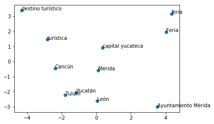

# geoparsingweb

CEGEOMEX y Geoparsing en español info

<!DOCTYPE html>
<html>

<body>
<body>

<h2>Geoparsing de noticias en español con datos del Corpus de Entidades Georreferenciadas de México</h2>

<h3>Corpus de Entidades Georreferenciadas de México</h3>

El <a href="named_entity_recognition_sp_MX_locations.JSON
" target="_blank">Corpus de Entidades Georreferenciadas de México, CEGEOMEX</a> es de libre acceso bajo los términos de atribución abajo mencionados.

<h3>Geoparsing en servicio web</h3>

Para usar el Geoparser como un servicio web utilice la URL:

<code>http://geoparsing.geoint.mx/ws/</code>

mediante petición HTTP POST Request enviando, en el cuerpo de la petición, un parámetro "text" con el texto a procesar.

Por ejemplo:

<code>
{
    "text": "Un grupo de presidentes municipales del país inicia hoy en Mérida la creación de una red de ciudades con buenas prácticas policiales con el fin de mantener o mejorar la seguridad pública en sus comunidades.\nPor iniciativa del alcalde Renán Barrera Concha y el liderazgo de la asociación civil Causa en Común, que dirige la activista ciudadana María Elena Morera Mitre, los alcaldes mexicanos invitados realizarán la mesa de diálogo “Trabajo Sociedad más Gobierno, la Construcción de Ciudades Seguras”. Será una reunión privada en un salón del Centro Cultural Olimpo.\nLa doctora Morera Mitre informó que en una reunión el alcalde Barrera Concha le propuso organizar un encuentro sobre seguridad en la capital yucateca, y aunque en un principio no lo consideró porque Mérida está considerada como una de las mejores ciudades para vivir precisamente por sus bajos índices delictivos, el alcalde meridano argumentó que aunque sea una ciudad segura siempre habrá desafíos en materia de seguridad pública.— Joaquín Chan Caamal\n“Mérida, a diferencia de otras ciudades de México y de otras donde hay mucho turismo, se caracteriza porque su sociedad es sumamente unida”, señaló. “Contrario a muchas ciudades de México, cuando venimos nos sorprende que las casas tienen las bardas bajitas, cuando en otros lados encontramos las más altas como medida de protección”."
}
</code>

generará como salida:

<code>
{
    "labeled": "Un grupo de presidentes municipales del país inicia hoy en <START:location> Mérida <END> la creación de una red de ciudades con buenas prácticas policiales con el fin de mantener o mejorar la seguridad pública en sus comunidades .\nPor iniciativa del alcalde Renán Barrera Concha y el liderazgo de la asociación civil Causa en Común , que dirige la activista ciudadana María Elena Morera Mitre , los alcaldes mexicanos invitados realizarán la mesa de diálogo “ Trabajo Sociedad más Gobierno , la Construcción de Ciudades Seguras ”. Será una reunión privada en un salón del <START:location> Centro Cultural Olimpo <END>.\n",
    "entities": [
        {
            "index": 1,
            "entity": "Mérida",
            "context": "Un grupo de presidentes municipales del país inicia hoy en  Mérida  la creación de una red de ciudades con buenas prácticas",
            "nonimatim": [
                {
                    "boundingbox": [
                        "20.8733088",
                        "21.0867259",
                        "-89.7261963",
                        "-89.5301684"
                    ],
                    "class": "place",
                    "display_name": "Mérida, Yucatán, México",
                    "icon": "/nominatim/images/mapicons/poi_place_city.p.20.png",
                    "importance": 0.57816344305869,
                    "lat": "20.9670759",
                    "licence": "Data 
    ...
</code>

<h2>Acerca del proyecto</h2>

En este proyecto se vislumbra la creación de métodos capaces de transformar voz o texto en identificadores geográficos inequívocos tales como latitud y longitud. Por ejemplo, un fragmento de noticia como: <i>"[...] el choque ocurrió esta mañana a cinco kilómetros al norte de la primera caseta de la carretera México-Puebla [...]"</i>, contiene la información necesaria para que un humano represente en un mapa el lugar exacto donde ocurrió el accidente. Sin embargo, una computadora no podría procesar la entrada directamente a menos que haya sido programada para decodificar el discurso y extraer el conocimiento que se le proporcione para luego convertirlo en datos estructurados. Nuestra propuesta metodológica incluye compilación de corpus, caracterización lingüística y desarrollo de algoritmos de aprendizaje de máquina (<i>Machine Learning</i>) para la construcción del primer geoparser para español de México.

<h3>Geoparsing</h3>

Geoparsing es un proceso sofisticado de análisis automático del lenguaje para detectar menciones de entidades geográficas y codificarlas en sus coordenadas. Dicho, grosso modo, se analiza el lenguaje y se obtienen mapas. Con miras al desarrollo del primer geoparser para español de México se han desarrollado simultáneamente varias líneas de investigación con metas parciales pero gracias a las cuales se ha podido integrar finalmente el software. Las secciones siguientes ofrecen un panorama muy somero de las líneas de investigación que desarrollamos.

<h3>Reconocimiento de Entidades Nombradas</h3>

El Reconocimiento de entidades nombradas (<i>NER</i> por sus siglas en inglés) es una tarea de extracción de información que busca localizar y clasificar entidades mencionadas en un texto en categorías predefinidas: personas, organizaciones, lugares, expresiones de tiempo, entre otras. Así, un módulo de NER debe procesar bloques de texto libre, como el siguiente:

<code>
Jim, originario de Seúl, compró 300 acciones de Acmé Corp. en 2006.
</code>

Y producir un bloque de texto anotado con las entidades detectadas:

<code>
&lt;PERSON&gt;Jim&lt;/PERSON&gt;, originario de &lt;LOC&gt;Seúl&lt;/LOC&gt;, compró 300 acciones de &lt;ORG&gt;Acmé Corp.&lt;/ORG&gt; en &lt;TIME&gt;2006&lt;/TIME&gt;.
</code>

En el ejemplo anterior, han sido detectados y clasificados el nombre de una persona, un nombre de ciudad, un nombre de compañía de (dos tokens o unidades léxicas) y una expresión temporal. Actualmente, los sistemas de reconocimiento de entidades para el inglés tienen un rendimiento cercano al humano pero cabe mencionar que para el español hay cierto rezago debido en parte a que hay menos corpora disponibles y los analizadores léxicos suelen ser menos sofisticados. 

<h3>Geographic Entity Recognition</h3>

En esta investigación abordamos especificamente la tarea conocida como <i>Geographic Entity Recognition (GER)</i>, también llamado reconocimiento de expresiones locativas (LER) o reconocimiento de expresiones espaciales, la cual busca detectar lugares y su posición o su relación geográfica con otros objetos o lugares georreferenciables. En GER existen dos complejidades adicionales al NER clásico: la primera complejidad es que existe una cantidad enorme de topónimos, lo que resulta en un alto grado de ambigüedad; la segunda complejidad es que el objetivo final es atribuir referencias geográficas a las entidades, lo que resulta en una dificultad adicional pues se resuelve a través de un módulo adicional que consulta recursos externos.

El siguiente es un ejemplo de un texto que contiene varias entidades georeferenciables, las cuales han sido detectadas mediante las técnicas que desarrollamos en esta investigación:

<code>
Con su gira Huevos Revueltos , Hombres G y Enanitos Verdes , 
agrupaciones que han dejado huella en el rock en español , 
llegarán a &lt;LOC&gt; Puebla &lt;/LOC&gt; el viernes 16 de marzo. 
El escenario será el &lt;LOC&gt; Centro Expositor &lt;/LOC&gt; 
de la zona de Los &lt;LOC&gt; Fuertes de Loreto y Guadalupe &lt;/LOC&gt;
en esta ciudad , donde las agrupaciones deleitarán al 
público con las canciones y ritmos que las hicieron legendarias, 
de acuerdo con un comunicado . 
Al concierto se esperan seguidores provenientes de &lt;LOC&gt;
Tlaxcala &lt;/LOC&gt; , &lt;LOC&gt; Estado de México &lt;/LOC&gt; ,
&lt;LOC&gt; Veracruz &lt;/LOC&gt; y &lt;LOC&gt; Oaxaca &lt;/LOC&gt; , 
quienes gozarán de esta fiesta del rock en español .
</code>

La detección de entidades geográficas recae en un modelo de reconocimiento generado con técnicas de aprendizaje supervisado. El modelo de reconocimiento fue entrenado con los datos del corpus descrito a continuación.

<h3>Corpus de Entidades Georreferenciadas de México</h3>

El Corpus de Entidades Georreferenciadas de México, CEGEOMEX propuesto por <a href="#molina2019extraccion">(Molina et al., 2019)</a> fue creado para desarrollar algoritmos de detección de entidades geográficas. CEGEOMEX fue anotado manualmente gracias al apoyo de la Red Temática en Tecnologías del Lenguaje y al Consorcio en Inteligencia Artificial CONACyT.
Cabe destacar que la anotación manual ya ha sido ampliamente utilizada en iniciativas internacionales tales como la CoNLL (<i>Conference on Natural Language Learning</i>) y que para este proyecto, resulta de especial interés la edición CoNLL 2002 reportada por (<a href="#sang2003introduction">Sang y De Meulder, 2003)</a> en donde por primera vez se consideró al español como una de las lenguas a procesar. Sin embargo, dado que en CoNLL 2002, los datos fueron recopilados por la Universidad Politécnica de Catalunya y la Universidad Autónoma de Barcelona, la anotación se focalizó en documentos de España, dejando de lado cualquier otra variante dialectal, entre ellas la mexicana. Hasta donde conocemos, CEGEOMEX es la única fuente de datos existente en español de México. 
CEGEOMEX cuenta actualmente con un total de 5,870 entidades nombradas
georeferenciables etiquetadas a partir de un corpus con 361,946
palabras distribuidas en 1,233 documentos de noticias de los
principales medios digitales de México. Los criterios de la anotación de CEGEOMEX así como su uso en un modelo de reconocimiento de entidades están descritos detalladamente en la tesis de <a href="#arreola2019">(Arreola, 2019)</a>.

<a href="named_entity_recognition_sp_MX_locations.JSON
" target="_blank">El Corpus de Entidades Georreferenciadas de México</a>, CEGEOMEX es de libre acceso bajo atribución de <a href="Licencia.txt" target="_blank">la licencia (CC BY 2.5 MX)</a>. Usted es libre de compartir, copiar y redistribuir el material en cualquier medio o formato; adaptar, remezclar, transformar y construir a partir del material para cualquier propósito, incluso comercialmente. Bajo los términos de atribución, con lo cual debe dar crédito de manera adecuada citando <a href="#molina2019extraccion">(Molina et al., 2019)</a> y brindando un enlace al recurso e indicar si se han realizado cambios. 

<h3>Reconocimiento de Entidades Georreferenciadas basado en Word Embeddings</h3>

Para el reconocimiento de Entidades Geográficas desarrollamos nuestro propio módulo de <i>
Geographic Entity Tagging</i> basado en un clasificador de red neuronal entrenado con vectores densos obtenidos a partir del <a href="named_entity_recognition_sp_MX_locations.JSON
" target="_blank">Corpus de Entidades Georreferenciadas de México</a>.
La red neuronal de clasificación evalúa los <i>embeddings</i> (vectores densos) del texto a etiquetar para determinar si un token es <i>Geographic Entity</i> o no lo es.
La red neuronal de clasificación tiene 1 capa oculta con 3 unidades y la función de activación es de tipo sigmoide. Como optimizador se utilizó <i>lbfgs</i>, el cual pertence a la familia de los métodos quasi-Newton. El parámetro de regularización L2 fue de 0.0001, mientras que la tasa de aprendizaje fue constante, con un valor de 0.0001. Todos los parámetros fueron calibrados mediante validación cruzada.

Los embeddings se obtuvieron a partir de tokens procesados utilizando el módulo word2vec <a href="#word_rep">(Mikolov et al., 2013)</a>. Además de los word embeddings se ha utilizado un Context Encoder (ConEc).  El entrenamiento del ConEc es idéntico al del word2vec, con la diferencia en el cálculo del word embedding después de que el entrenamiento se completó. En el caso de word2vec, el embedding es la fila de la matriz \(W_0\) mientras que en el caso de ConEc se crea la representación de la palabra multiplicando \(W_0\) con el vector de contexto promedio \(x_W\) de la palabra.

Se hace la distinción entre el vector de contexto local y global de una palabra. El vector global se calcula como el promedio de todos los vectores binarios de contexto \(x_{w_i}\) correspondientes a las \(M_w\) ocurrencias de \(w\) en el corpus de
entrenamiento, de acuerdo a la ecuación \ref{eq413}.

\begin{equation}
    x_{w_{global}} = \frac{1}{M_w} \sum_{i=1}^{M_w} x_{w_i}        
  \label{eq413}
\end{equation}

Mientras que el vector de contexto local se calcula como se muestra en la ecuación \ref{eq414}.

\begin{equation}
    x_{w_{local}} = \frac{1}{m_w} \sum_{i=1}^{m_w}x_{w_i}
\label{eq414}
\end{equation}

donde \(m_w\) corresponde a las ocurrencias de \(w\) en un solo
documento. Así, el embedding de una palabra se calcula como se muestra en la ecuación \ref{eq415}.

\begin{equation}
    y_w = (\alpha \cdot x_{w_global} + (1 - \alpha) \cdot
x_{w_local})^T W_0
    \label{eq415}
\end{equation}

con \(\alpha \in [0,1]\). 

La elección de \(\alpha\) determina qué tanto
énfasis se le da al contexto local de la palabra, lo que ayuda a
distinguir entre múltiples significados de una misma palabra. Como una
palabra fuera de vocabulario no tiene un vector de contexto global (ya
que no pertenece al corpus de entrenamiento), su embedding se calcula
tomando en cuenta únicamente el contexto local, es decir, tomando
\(\alpha = 0\).

Finalmente, para usar el modelo clasificador de entidades geográficas, el texto es codificado vectorialmente, evaluado por el clasificador y reconstruido mediante una heurística. Todo el proceso de Geographic Named Entity Recognition es detallado en <a href="#arreola2019">(Arreola, 2019)</a>.

<h3>Desempeño del modelo de reconocimiento de Entidades</h3>

El desempeño del modelo de reconocimiento de Entidades del CentroGEO fue evaluado con 300 noticias manualmente anotadas y adicionales a las del entrenamiento. Adicional a nuestro modelo se utilizaron dos de las bibliotecas más importantes en el estado del arte de Procesamiento de Lenguaje Natural: spaCy y Apache OpenNLP. Los resultados mostrados en la Tabla 1.

 

<table align="center">
    <tbody>
        <tr>
            <th> </th>
            <th>CentroGEO</th>
            <th>spaCy</th>
            <th>Apache OpenNLP</th>
        </tr>
        <tr>
            <td>F1 score</td>
            <td>0.5995</td>
            <td>0.4529</td>
            <td>0.3108</td>
        </tr>
        <tr>
            <td>Recall</td>
            <td>0.6759</td>
            <td>0.4454</td>
            <td>0.1863</td>
        </tr>
        <tr>
            <td>Precision</td>
            <td>0.5387</td>
            <td>0.4608</td>
            <td>0.9358</td>
        </tr>
    </tbody>
          <caption>Tabla 1. Comparativa del desempeño de nuestro modelo de reconocimiento de Entidades Geográficas en español de México contra dos de las bibliotecas más importantes en el estado del arte de Procesamiento de Lenguaje Natural: spaCy y  OpenNLP.</caption>
</table>

<h3>Conclusiones y perspectivas de trabajo futuro</h3>

Hemos presentado las ideas principales subyacentes a los métodos avanzados de Geoparsing en discurso libre, principalmente enfocándonos en el reconocimiento de entidades basado en word embeddings. Los resultados de la propuesta implementada son de calidad comparable al de las bibliotecas más importantes en el estado del arte de Procesamiento de Lenguaje Natural y superior en el caso de noticias en español de México lo cual es prometedor en aplicaciones de análisis de redes sociales en México <a href="#lopez2019">(López et al., 2019)</a>.

Un aspecto muy interesante del modelo de reconocimiento de entidades geográficas basado en word embeddings es que parece relacionar de manera coherente las entidades con sus correspondientes vecinos de nivel geográfico. Como puede apreciarse en la Figura 1 y Figura 2,  los embeddings de "Mérida" y "calle Madero" proyectados en el espacio generado por sus dos primeros componentes principales tienen vecinos asociados a ciudades y a vialidades respectivamente. Este efecto lo hemos estudiado únicamente a nivel meramente exploratorio pero parece prometedor puesto que de confirmarse dicha hipótesis, se podría explotar para determinar niveles geográficos además de reconocer entidades.

Quedan varias líneas de investigación abiertas, además de las ya mencionadas. Por ejemplo, se quiere agregar un algoritmo de desambiguación de topónimos, el cual tome en cuenta el contexto local. Esta línea ya ha sido explorada en <a href="#alcantara2019">(Alcántara, 2019)</a> con resultados interesantes. También tenemos la perspectiva de crear un corpus con transcripciones de noticias de radio y televisión para capturar los fenomenos lingüístícos en la producción oral. Lo anterior permitiría acoplar reconocimiento de voz con georeferenciación en tiempo real.

    

        
        <figcaption>Figura 1. Las 10 palabras más similares a Mérida. Las entidades georeferenciables que aparecen son Cancún, Tulum y León. Es interesante mencionar que dichas entidades estan en el niveles jerárquicos geográficos cercanos, es decir, son municipios o ciudades.</figcaption>
    

    

        
        <figcaption>Figura 2.  Se observa que, al poner una entidad a nivel de
calle como Calle Madero, aparecen entidades de la misma jerarquía, como
avenida Hidalgo, avenida Insurgentes, Eje Central y avenida Universidad.
Cabe mencionar que todos son nombres de vialidades importantes de la ciudad de México. Además, aparecen tambien entidades que geográficamente se
encuentran cercanas a dicha calle, como la Alameda, Plaza de Armas o la
Plaza Fundadores.</figcaption>
    

 

<h3>Grupo de trabajo e instituciones participantes</h3>

<h5>Centro de Investigación en Ciencias de Información Geoespacial - Mérida</h5>

  <ul>
    <li> Dr. Alejandro Molina Villegas. Responsable Técnico: Procesamiento de Lenguaje Natural, Minería de datos; </li>
    <li> Dr. Oscar Sanchez Siordia. Coordinador del centro e Investigador titular: Reconocimiento de Patrones, Geomática;</li>
    <li> Ing. en computación Sergio Gongora Euan. Programador de sistemas.</li>
  </ul>

<h5>Centro de Investigación y Estudios Avanzados del Instituto Politécnico Nacional - Tamaulipas</h5>
  <ul>
    <li> Dr. Edwyn Javier Aldana Bobadilla. Investigador. Aprendizaje de Máquina, Algoritmos Híbridos;</li>
    <li>Shanel Daniela Reyes Palacios. Tesista de posgrado.</li>
  </ul>

<h5>Centro de Investigación en Matemáticas - Monterrey</h5>
  <ul>
    <li>Dr. Víctor Hugo Muñiz Sánchez. Investigador. Aprendizaje estadístico supervisado y no supervisado, análisis exploratorio de datos y técnicas de reducción de dimensión;</li>
    <li>Jean Michel Arreola Trapala. Tesista de posgrado;</li>
    <li>Filomeno Alberto Alcántara Alonso. Tesista de posgrado.</li>
  </ul>

<h3>Colaboradores</h3>

  <ul>
    <li>Laboratorio de Datos (DataLab) del Laboratorio Nacional de Geointeligencia (GeoInt)</li>
  </ul>

<h3>Referencias</h3>

  <ol>
    <li>[Molina-Villegas et al., 2019] Molina-Villegas Alejandro, S. Siordia Oscar, Aldana-Bobadilla Edwin, Aguilar César and Acosta Olga. <cite><i>Extracción automática de referencias geoespaciales en discurso libre usando técnicas de procesamiento de lenguaje natural y teoría de la accesibilidad</i><cite>. Procesamiento del Lenguaje Natural. (SEPLN), 2019.</li>
    <li>[Sang y De Meulder, 2003] Sang Erik F. y De Meulder, Fier. <cite><i>Introduction to the conll-2003 shared task: Language-independent named entity recognition. arXiv preprint cs/0306050</i><cite>. 2003.</li>
    <li>[Arreola, 2019]  Arreola Trapala Jean<cite><i>Reconocimiento de Entidades Nombradas Georeferenciables con Word Embeddings</i><cite>. Tesis de posgrado Centro de Investigación en Matemáticas Unidad Monterrey, Agosto 2019.</li>
    <li>[Mikolov et al., 2013] Mikolov Tomas, Chen Kai, Corrado Greg and Dean Jeffrey. <cite><i>Efficient estimation of word representations in vector space</i><cite>. CoRR, vol. abs/1301.3781, 2013.</li>
    <li>[Alcántara, 2019]  Alcántara Alonso Filomeno.<cite><i>Métodos de desambigüación para Geoparsing en Textos en Español</i><cite>. Tesis de posgrado Centro de Investigación en Matemáticas Unidad Monterrey, Agosto 2019.</li>
    <li>[López et al., 2019]  López-Ramírez Pablo, Molina-Villegas Alejandro and S. Siordia Oscar. <cite><i>Geographical aggregation of microblog posts for LDA topic modeling.</i><cite>Journal of Intelligent and Fuzzy Systems 36(5): 4901-4908 (2019).</li>
  </ol>

</body>
</html>

